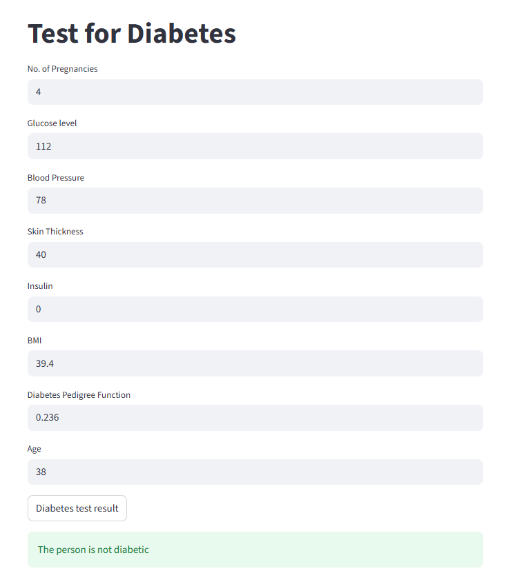

# 🩺 Diabetes Prediction System

A Machine Learning web application that predicts whether a person is likely to have diabetes based on medical parameters.

---

## 🚀 Overview

This project uses a **Support Vector Machine (SVM)** model trained on a real-world dataset to classify diabetes outcomes.
The model is deployed using **Streamlit**, enabling users to input health data and get instant predictions.

---

## 📊 Problem Statement

Diabetes is a serious health condition that requires early detection.
This project aims to assist in predicting diabetes risk using machine learning techniques.

---

## ⚙️ Workflow

1. Data Collection
2. Data Preprocessing
3. Exploratory Data Analysis (EDA)
4. Model Training (SVM)
5. Model Evaluation
6. Deployment using Streamlit

---

## 📊 Input Parameters

* Pregnancies
* Glucose
* Blood Pressure
* Skin Thickness
* Insulin
* BMI
* Diabetes Pedigree Function
* Age

---

## 📈 Model Details

* Algorithm: **Support Vector Machine (SVM)**
* Library: Scikit-learn
* Type: Classification

## 📈 Model Performance
- Accuracy: 78%
  
---

## 🖥️ Application Preview



---

## 🛠️ Tech Stack

* **Language:** Python
* **Libraries:** NumPy, Pandas, Scikit-learn
* **Visualization:** Matplotlib, Seaborn
* **Deployment:** Streamlit

---

## ▶️ Run Locally

```bash
pip install -r requirements.txt
streamlit run app.py
```

---

## 💡 Features

* Real-time prediction
* Simple and clean UI
* Fast and lightweight model

---

## 🔮 Future Improvements

* Add advanced models (Random Forest, XGBoost)
* Improve accuracy with hyperparameter tuning
* Deploy online (Streamlit Cloud)

---

⭐ *If you found this useful, consider giving it a star!*
